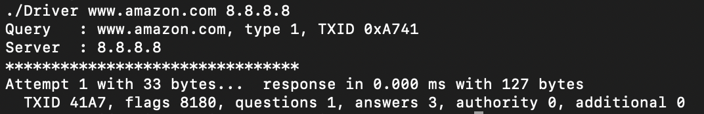
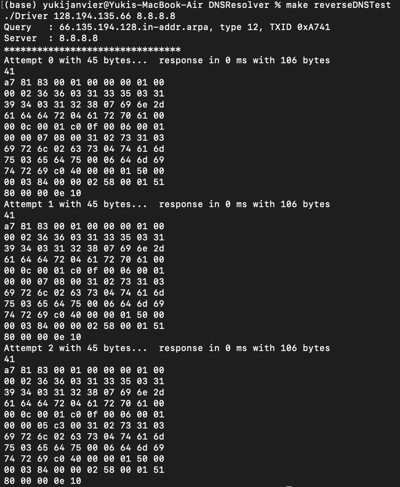

# DNS Resolver
This is a basic DNS resolver done using C++.

## Usage
In order to run the program, run the following in command line:

1. Clone the repository and navigate to the repo location through the command line.
2. Run `make clean` to clean the repo.
3. Run `make all` to compile.
4. Run `./Driver [LookUp IP or URL] [DNS Server IP]`.

Some basic tests can be ran if you do not have a Look Up IP or DNS server IP readily available, check makefile for tests.

## Progress Updates

### Working normal DNS queries, successfully parse header
DNS Resolver is now able to receive and parse portion of data, specifically the DNS response header. Actively working on parsing rest of data (records).

### Able to fetch data for reverse DNS queries
DNS Resolver is able to send and receive queries for reverse DNS queries. The raw data still needs to be parsed.
